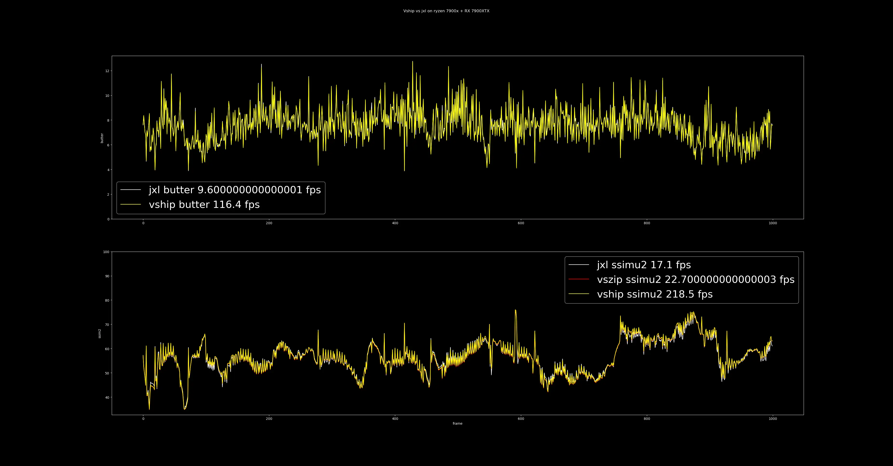

# Vapoursynth-HIP (vship)

A high-performance VapourSynth plugin for GPU-accelerated visual fidelity
metrics, focusing on SSIMULACRA2 & Butteraugli.

## Overview

`vship` provides hardware-accelerated implementations of:

- **SSIMULACRA2**: A perceptual image quality metric from Cloudinary's
  SSIMULACRA2
- **Butteraugli**: Google's psychovisual image difference metric from libjxl

The plugin uses HIP/CUDA for GPU acceleration, providing significant performance
improvements over CPU implementations.

## Projects Featuring Vship

If you want to use Vship with a pre-defined workflow, here are some projects
featuring Vship:

- [SSIMULACRApy](https://codeberg.org/Kosaka/ssimulacrapy): A Python script to
  compare videos and output their SSIMU2 scores using various metrics (by
  [Kosaka](https://codeberg.org/Kosaka))
- [`metrics`](https://github.com/psy-ex/metrics): A perceptual video metrics
  toolkit for video encoder developers (by the
  [Psychovisual Experts Group](https://github.com/psy-ex/metrics))
- [`vs_align`](https://github.com/pifroggi/vs_align): A vapoursynth plugin
  measuring temporal offset between two videos
- [`chunknorris`](https://github.com/Boulder08/chunknorris): A python script
  to adjust the quality encoding parameters at each scene of a video base on objective metrics
- [Media-Metrologist](https://github.com/Av1ation-Association/Media-Metrologist): Media-Metrologist is a library for measuring video quality using a suite of metrics on a per-scene and per-frame basis.
- [`lvsfunc`](https://github.com/Jaded-Encoding-Thaumaturgy/lvsfunc): JET project containing various functions to help with video processing.

## Installation

The steps to build `vship` from source are provided below.

### Prerequisites

- `make`
- `hipcc` (AMD) or `nvcc` (NVIDIA)
- VapourSynth

### Build Instructions

0. Ensure you have all of the dependencies properly installed.

1. Use the appropriate `make` command to build on your GPU

```bash
make buildcuda # for NVIDIA GPUs
make build     # for AMD GPUs
```

2. Install the `vship` library:

```bash
make install
```

> Note: By default, the build is optimized for the specific GPU used during
> compilation.

## Library Usage

### Threads

In order to control the performance-to-VRAM trade-off, you may set
`vs.core.num_threads`. 4 is typically a good compromise between both.

```python
import vapoursynth as vs
core = vs.core
core.num_threads = 4  # Adjust based on your GPU's VRAM
```

VRAM requirements per active VapourSynth thread:

- **SSIMULACRA2**: `24 * 4 * width * height * 4/3` bytes
- **Butteraugli**: `34 * 4 * width * height` bytes

### SSIMULACRA2

```python
import vapoursynth as vs
core = vs.core

# Load reference and distorted clips
ref = core.bs.VideoSource("reference.mp4")
dist = core.bs.VideoSource("distorted.mp4")

# Calculate SSIMULACRA2 scores
result = ref.vship.SSIMULACRA2(dist)

# Extract scores from frame properties
scores = [frame.props["_SSIMULACRA2"] for frame in result.frames()]

# Print average score
print(f"Average SSIMULACRA2 score: {sum(scores) / len(scores)}")
```

### Butteraugli

```python
import vapoursynth as vs
core = vs.core

# Load reference and distorted clips
ref = core.bs.VideoSource("reference.mp4")
dist = core.bs.VideoSource("distorted.mp4")

# Calculate Butteraugli scores
# intensity_multiplier controls sensitivity
result = ref.vship.BUTTERAUGLI(dist, intensity_multiplier=80, distmap=0)

# Extract scores from frame properties (three different norms available)
scores_2norm = [frame.props["_BUTTERAUGLI_2Norm"] for frame in result.frames()]
scores_3norm = [frame.props["_BUTTERAUGLI_3Norm"] for frame in result.frames()]
scores_infnorm = [frame.props["_BUTTERAUGLI_INFNorm"] for frame in result.frames()]

# Get all scores in one pass
all_scores = [[frame.props["_BUTTERAUGLI_2Norm"],
               frame.props["_BUTTERAUGLI_3Norm"],
               frame.props["_BUTTERAUGLI_INFNorm"]]
              for frame in result.frames()]

# Print average scores
print(f"Average Butteraugli 3Norm distance: {sum(scores_3norm) / len(scores_3norm)})
print(f"Average Butteraugli 2Norm distance: {sum(scores_2norm) / len(scores_2norm)})
print(f"Average Butteraugli MaxNorm distance: {sum(scores_infnorm) / len(scores_infnorm)})
```

You are also able to generate visual distortion maps with Butteraugli:

```python
# Set distmap=1 to visualize distortion
distmap_result = ref.vship.BUTTERAUGLI(dist, intensity_multiplier=80, distmap=1)

# The resulting clip is a grayscale visualization of distortions
distmap_result.set_output()
```

## Performance



`vship` dramatically outperforms CPU-based implementations of these metrics
while preserving a high degree of accuracy.

## References

- Butteraugli Source Code:
  [libjxl/libjxl](https://github.com/libjxl/libjxl/tree/main/lib/jxl/butteraugli)
- SSIMULACRA2 Source Code:
  [cloudinary/ssimulacra2](https://github.com/cloudinary/ssimulacra2)

## Credits

Special thanks to dnjulek for the Zig-based SSIMULACRA2 implementation in
[vszip](https://github.com/dnjulek/vapoursynth-zip).

## License

This project is licensed under the MIT license. License information is provided
by the [LICENSE](LICENSE).
